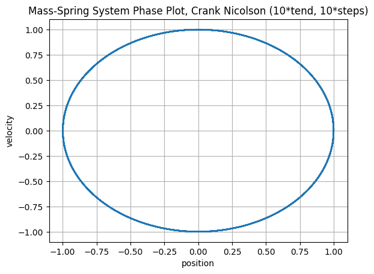
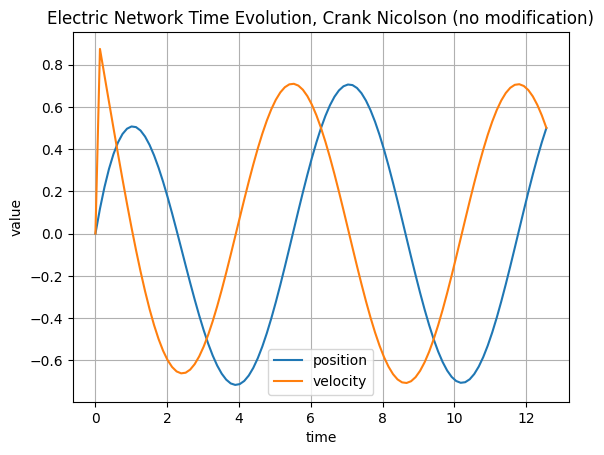
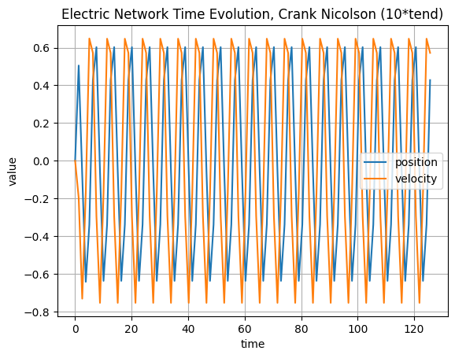
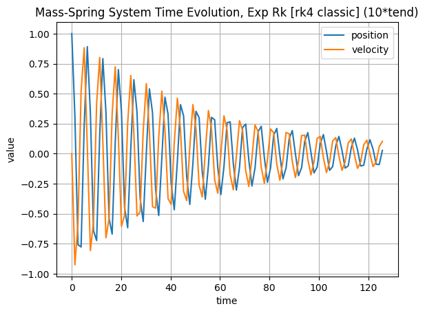

# ASC-ODE

A package for solving ordinary differential equations

Read the [documentation](https://tuwien-asc.github.io/ASC-ODE/intro.html)

Find theory behind here: <https://jschoeberl.github.io/IntroSC/ODEs/ODEs.html>

## The Group

We are *team07*
Members:

* Anton Zamyatin <e12223389@student.tuwien.ac.at>
* Martin Huber <martin.huber@tuwien.ac.at>
* Jimmy-Daniel Vacareanu <e11901909@student.tuwien.ac.at>
* Hannah Teis <e12120508@student.tuwien.ac.at>

## The Task

* Solve the exercises from the jupyterbook: [LINK](https://jschoeberl.github.io/IntroSC/ODEs/ODEs.html)
  * Exercise 1: Jupyterbook Sections 14 - 17
    * [Explicit and Improved Euler](https://jschoeberl.github.io/IntroSC/ODEs/implementation_ee.html#exercise)
    * [Implicit Euler and Crank-Nicolson](https://jschoeberl.github.io/IntroSC/ODEs/implementation_ie.html#excercises) (first 3 tasks)
  * Exercise 2: Jupyterbook Sections 17 - 19
    * [Model electric network with ODE](https://jschoeberl.github.io/IntroSC/ODEs/implementation_ie.html#excercises) (last task)
    * [Automatic Differentiation part1](https://jschoeberl.github.io/IntroSC/ODEs/implementation_ad.html#exercises)
    * [Automatic Differentiation part2](https://jschoeberl.github.io/IntroSC/ODEs/implementation_ad.html#exercise-test-the-autodiff-class-for-the-pendulum)
    * [Runge-Kutta methods](https://jschoeberl.github.io/IntroSC/ODEs/RungeKutta.html#exercises)
  * Exercise 3: Jupyter book Section 20
    * The Exercise can be found [HERE](https://jschoeberl.github.io/IntroSC/ODEs/mechanical.html)
    * [Mass-spring System with Newmark branch](https://jschoeberl.github.io/IntroSC/ODEs/mechanical.html#mass-spring-system)
* Push your homework into your git repository (this repository)

## Running the Code

### How to compile?

`git clone git@github.com:jimmyvcr/nssc1-team07.git`

Then you can use cmake to build ASC-ODE:

```
mkdir build
cd build
cmake ..
make
```

To run the main demo with default settings (mass-spring system, explicit Euler), execute

```
cd build
./test_ode --stepper exp_euler --rhs mass_spring
```

### Command-line interface of `test_ode`

`test_ode` now uses named options so different steppers and right-hand sides can be selected consistently:

```
./test_ode --stepper <name> [--rhs <mass_spring|electric_network>] [--stages <int>] [--n-factor <double>] [--t-end-factor <double>]
```

* `--stepper` (required): `exp_euler`, `impl_euler`, `impr_euler`, `crank_nicolson`, `impl_rk_gauss_legendre`, `impl_rk_gauss_radau`.
* `--rhs` (default `mass_spring`): switches the modeled system.
`electric_network` is reserved for the upcoming circuit model.
* `--stages`: required only for the Gauss–Legendre/Gauss–Radau implicit RK steppers; specifies the number of stages.
* `--n-factor`, `--t-end-factor`: scale the baseline number of steps (`N=100`) and simulation horizon (`T_end=4π`).

Both `--opt value` and `--opt=value` syntaxes are supported. Example (3-stage Gauss–Legendre with increased resolution and end-time):

```
./test_ode --rhs mass_spring --stepper impl_rk_gauss_legendre --stages 3 --n-factor 10 --t-end-factor 10
```

### Plotting

First, navigate to the root directory and install all Python dependencies using `uv`:

```bash
uv sync
```

After running the `test_ode` programm as described above, you can plot the results saved to `build/<system>_<stepper>_*.txt` by calling:

```bash
uv run demos/plot_ode_results.py build/<system>_<stepper>_*.txt
```

The plots will be saved to `demos/<Stepper>/<system>_phase_*.png` and `demos/<Stepper>/<system>_time_evolution_*.png`.

## Exercise 1

### Different time-steps and larger end-times

Exact solution of mass-spring ODE results in sinusoidal oscillation over time (time evolution) and circular phase plot. The updates with explicit Euler are not (totally) energy conserving and so numerical errors accumulate over time. In the following plots different time-step sizes are combined with varying end-times. Their effect on the accuracy of the resulting numerical solution is interpreted.  

#### Base configuration

The first row corresponds to the given parameters for time-step and end-time.

Calculation time: $t_{end} = 4*\pi = T$ \
Number of steps: $n = 100 = N$ \
Frequency: $\tau= \frac{t_{end}}{n} = \frac{T}{N}= \frac{4*\pi}{100}$

#### More time steps

The second row displays results for 10-times smaller time steps.
Calculation time: $t_{end} = T$ \
Number of steps: $n = N*10$ \
Frequency: $\tau= \frac{t_{end}}{n} = \frac{T}{N*10}$

#### Longer simulation

The third row shows results for a 10-times bigger end-time.

Calculation time: $t_{end} = T*10$ \
Number of steps: $n = N$ \
Frequency: $\tau= \frac{t_{end}}{n} = \frac{T*10}{N}$

#### Longer simulation with more time steps

The last row shows what a combined 10-times smaller time steps and 10-times bigger end-time results in.

Calculation time: $t_{end} = T*10$ \
Number of steps: $n = N*10$ \
Frequency: $\tau= \frac{t_{end}}{n} = \frac{T*10}{N*10}= \frac{T}{N}$

### Explicit Euler

When the time interval is divided into ten times more steps, the explicit Euler method produces more intermediate approximations with smaller local, numerical errors. This results in a solution that more closely matches the analytical sinusoid. This is also reflected in the plots, as the numerical solution is closer to a circle in the phase plot (reduced spiral artifacts), and a sinusiod over time (amplitude preservation).

When the end-time is increased while keeping the number of steps constant, the step size becomes larger. This reduces the number of intermediate approximations and increases the local numerical error. Because explicit Euler propagates each step from the previous one, these errors accumulate over time, leading to a larger overall deviation from the exact solution.
This can be seen in the plots: the phase plot no longer resembles a circle, and the time evolution shows an almost flat sinusoid with growing deviations toward the end (amplitude grows beyond analytical bounds).

Increasing both the number of steps and the end-time by the same factor keeps the step size unchanged, so one might expect the results to somewhat match the original calculation. However, although the local error per step is the same, the longer simulation involves more steps, and because explicit Euler propagates errors, the solution gradually deviates more from the exact trajectory.


### Improved Euler

In contrast to the Explicit Euler method, the improved Euler method is more stable with longer similuation time (as long as the number of steps is scaled accordingly).


### Implicit Euler

With the implicit Euler method we observe similar to behavior and stability as the explicit Euler method with the sole difference that instability manifests itself as exponential dampening rather than exponential growth.


### Crank-Nicolson

Similar to the improved Euelr for the explicit Euler, the Crank-Nicolson method is a more stable version of the implicit Euler method.
As seen in the plots, Crank-Nicolson has improved stability over the implicit Euler method as the similuation time is increased.
Notably, it is even stabler then the improved Euler as the number of steps gets smaller, i.e. the step size get larger; the phase diagram is still circular, although with some artifact but does not spiral.





#### Reproducing the datasets

All curves for Exercise&nbsp;1 were generated from the `build/` directory with the following commands (named CLI options are required now):

```bash
cd build

# Explicit Euler
./test_ode --stepper exp_euler
./test_ode --stepper exp_euler --n-factor 10
./test_ode --stepper exp_euler --t-end-factor 10
./test_ode --stepper exp_euler --n-factor 10 --t-end-factor 10

# Improved Euler
./test_ode --stepper impr_euler
./test_ode --stepper impr_euler --n-factor 10
./test_ode --stepper impr_euler --t-end-factor 10
./test_ode --stepper impr_euler --n-factor 10 --t-end-factor 10

# Implicit Euler
./test_ode --stepper impl_euler
./test_ode --stepper impl_euler --n-factor 10
./test_ode --stepper impl_euler --t-end-factor 10
./test_ode --stepper impl_euler --n-factor 10 --t-end-factor 10

# Crank–Nicolson
./test_ode --stepper crank_nicolson
./test_ode --stepper crank_nicolson --n-factor 10
./test_ode --stepper crank_nicolson --t-end-factor 10
./test_ode --stepper crank_nicolson --n-factor 10 --t-end-factor 10
```

Each run produces a `mass_spring_<stepper>_<suffix>.txt` file inside `build/`. To obtain the figures used in the report, run the plotting helper from the repository root (it automatically looks inside `build/` when only a filename is supplied):

```bash
python demos/plot_ode_results.py mass_spring_exp_euler_nomod.txt
python demos/plot_ode_results.py mass_spring_exp_euler_10steps.txt
python demos/plot_ode_results.py mass_spring_exp_euler_10tend.txt
python demos/plot_ode_results.py mass_spring_exp_euler_10tend_10steps.txt
# …repeat for impr_euler, impl_euler, crank_nicolson
```

Each invocation drops the corresponding `mass_spring_time_evolution_*.png` and `mass_spring_phase_*.png` files into the stepper-specific folder under `demos/`.

## Exercise 2

### Electric Network

The system is described by a second-order ODE ($y_1'(t) = -\frac{1}{RC} y_1(t) + \frac{1}{RC} \cos(\omega t))$, converted into a 2D system where the state vector y = (position, velocity). For the electric circuit analogy, "position" represents the charge on the capacitor and "velocity" represents the current.

#### Comparison of Methods

##### Explicit Euler (Unstable and Adds Energy)

The Explicit Euler method is only conditionally stable and is unsuitable for purely oscillatory systems. Its stability region does not cover the imaginary axis, where the eigenvalues for this system lie.

###### Standard Time Step

The phase plot shows a clear outward spiral, and the time evolution plot reveals a slowly but steadily increasing amplitude. The method continuously adds artificial energy to the system, causing it to diverge from the true solution.

###### Large Time Step (10 * tend)

The instability becomes more visible. The solution is immediately thrown into a high-energy state. The phase plot is jagged, and the time evolution is non-physical. This shows a complete breakdown of the method.


<br>


##### Implicit Euler (Removes Energy)

In direct contrast to its explicit counterpart, the Implicit Euler method is stable, but this stability comes at the cost of introducing significant numerical damping.

###### Standard Time Step

The phase plot shows an inward spiral, and the time evolution plot shows the amplitude slowly decaying. The method artificially removes energy from the system, which is incorrect for a conservative system.

###### Large Time Step (10 * tend)

The damping effect is more visible. The amplitude is immediately and severely dampened, settling into a low-energy oscillation that is a fraction of the true solution's amplitude. While the method remains stable, it is inaccurate, as it has dissipated a significant portion of the system's energy.


<br>


##### Crank-Nicolson (Preserves Energy)

The Crank-Nicolson method shows better stability and accuracy for oscillatory problems, correctly capturing the conservative nature of the system.

###### Standard Time Step

The phase plot shows a stable, closed loop, and the time evolution shows a constant amplitude. The method accurately preserves the system's energy.

###### Large Time Step (10 * tend)

Even with a much larger time step, the method remains stable and energy preserving. The amplitude of the oscillation does not grow or decay. The trajectory becomes more angular due to the coarse time step, but it remains on a stable, closed path. This shows its suitability simulations of oscillatory systems.



<br>


### Autodiff

To make the `autodiff.hpp` a (fully) functional Automatic Differentiation class operators and functions were added:

* Operators:
  * operator* (T a, const AutoDiff<N,T>& b): scalar multiplication
  * operator/ (const AutoDiff<N,T>& a, const AutoDiff<N,T>& b): division using the quotient rule
  * operator- (const AutoDiff<N,T>& a, const AutoDiff<N,T>& b): subtraction
  * operator- (const AutoDiff<N, T> &a): unary negation of value and derivatives
  * operator== (const AutoDiff<N,T>& a, const AutoDiff<N,T>& b): compares both values and derivatives
* Functions:
  * Basic trigonometric functions cos(x), tan(x): cos (const AutoDiff<N, T> &a), tan (const AutoDiff<N, T> &a)
  * Exponential $e^x$: exp (const AutoDiff<N, T> &a)
  * Logarithmic log(x): log (const AutoDiff<N, T> &a)
  * Power $a^x$, $x^a$: pow (const AutoDiff<N, T> &a, T exp), pow (T a,const AutoDiff<N, T> &exp)
  * Squareroot $\sqrt{x}$ as a wrapper of pow function: sqr (const AutoDiff<N, T>& a)

#### Legendre polynomials

`legendre_autodiff.cpp` evaluates Legendre polynomials up to order 5 over the interval `[-1, 1]` and writes the results to a CSV file with columns x, P0, dP0/dx, P1, dP1/dx, ..., P5, dP5/dx

`plot_legendre.py` reads this CSV and generates plots of the polynomials and their derivatives. Both the CSV and the plots are saved in `demos/Legendre`.


**Compilation:**

```bash
g++ -std=c++20 -I./src demos/legendre_autodiff.cpp -o demos/legendre_autodiff
```

The pendulum class is implemented in `nonlinfunc.hpp`.
`pendulum_demo.cpp` evaluates the pendulum system and prints the function values and Jacobian to the terminal.

**Compilation:**

```bash
g++ -std=c++20 -I./src demos/legendre_autodiff.cpp -o demos/legendre_autodiff
```

### Runge-Kutta (RK)

The order of the RK method depends on the polynomial exactness of the quadrature rule used.
We compare to quadrature rules:

1. Gauss–Radau

* One endpoint is included (left or right)

* $s$ nodes $\to$ polynomial exactness up to degree $2s−2$
* RK method order = $2s−1$

2. Gauss–Legendre

* No endpoints included

* $s$ nodes $\to$ polynomial exactness up to degree $2s−1$
* RK method order = 2s (optimal!)

#### Implicit 2-point Runge-Kutta

The 2‑stage RK schemes extend the midpoint rule by adding a second quadrature node.
Because Gauss–Legendre places both nodes strictly inside the interval, it achieves higher accuracy than Gauss–Radau, which fixes one node at the endpoint.
The impact shows up most clearly for long simulations (third row):
Gauss–Radau’s solution amplitude decays rapidly, while Gauss–Legendre preserves the oscillation almost perfectly.
Both methods still exhibit a phase shift as the simulation lengthens.

##### Gauss-Radau quadrature


##### Gauss-Legendre quadrature


#### Implicit 3-point Runge-Kutta

Adding an extra quadrature point for a total of $s=3$ points notably improves accuracy of the RK method for both quadrature schemes.
It effectively eliminates phase shift and reduces errors due to amplitude decay (although Gauss-Radau still experiences some decay).

##### Gauss-Radau quadrature


##### Gauss-Legendre quadrature


#### Explicit Runge-Kutta

Explicit RK steppers load their Butcher tableaux from folders that start with the prefix `ExplicitRK`. Each folder must contain a `tableau.txt` file. For instance, `demos/ExplicitRK_RK4Classic/tableau.txt` stores the standard RK4 tableau and can be reused for any run.

**Running `test_ode`:**

```bash
cd build
./test_ode --rhs mass_spring --stepper exp_rk --tableau-folder ../demos/ExplicitRK_RK4Classic
./test_ode --rhs mass_spring --stepper exp_rk --tableau-folder ../demos/ExplicitRK_RK4Classic --n-factor 10
./test_ode --rhs mass_spring --stepper exp_rk --tableau-folder ../demos/ExplicitRK_RK4Classic --t-end-factor 10
./test_ode --rhs mass_spring --stepper exp_rk --tableau-folder ../demos/ExplicitRK_RK4Classic --n-factor 10 --t-end-factor 10
```

`--tableau-folder` accepts relative paths, so tab-completion works both from the repo root and from `build/`. The output files follow the pattern `mass_spring_exp_rk_<folder_suffix>_<modifiers>.txt` (e.g., `mass_spring_exp_rk_rk4classic_nomod.txt`).

**Plotting explicit RK runs:**

```bash
uv run demos/plot_ode_results.py build/mass_spring_exp_rk_rk4classic_nomod.txt
uv run demos/plot_ode_results.py build/mass_spring_exp_rk_rk4classic_10steps.txt
uv run demos/plot_ode_results.py build/mass_spring_exp_rk_rk4classic_10tend.txt
uv run demos/plot_ode_results.py build/mass_spring_exp_rk_rk4classic_10tend_10steps.txt
```

The plotting helper automatically writes the figures into `demos/ExplicitRK_RK4Classic/` and uses filenames of the form `mass_spring_time_evolution_<modifiers>.png` / `mass_spring_phase_<modifiers>.png`.
Only the physical modifiers (e.g., `10steps`, `10tend`) remain in the filename; the RK tableau is implied by the folder.

##### Classic $RK_4$

The classical fourth-order Runge–Kutta scheme exhibits phase drift and amplitude damping comparable to the 2-point Gauss–Radau method.
Despite using four stages, it achieves only second-order accuracy because two of those stages coincide with the interval endpoints.





## Exercise 3

### Examples for mass_sping

### Add Distance Constraints

Implementation of Distance Constraints in mass_spring.hpp:
DistanceConstraints class
- class variables: connectors (array of 2 connectors on which constraint is applied) and length (as constraint)  

MassSpringSystem class
- added constraints as class variable m_constraints
- basic functions: 
  - constraints(): get constraints
  - addConstraint(DistanceConstraint c): extend m_constraints vector with c and returns index of added element
  - constraints printed as part of obj

MSS_Function   
To enforce constraints if they are added

--> M distance constraints add M (scalar) Lagrange multipliers $\lambda$ as unknowns -> extend dimX with M   
--> each constraint gives one scalar equation to solve, matching the number of unknowns -> extend dimF with number of constraints 

evaluate(VectorView<double> x, VectorView<double> f): evaluates physical right hand side of mass-spring system by computing gravity + spring forces (acceleration) for every mass with given x (current mass position) and f (pre-allocated memory for force) --> $f(x)=a(x)$

--> For each constraint
- get Lagrange multiplier $\lambda$ from unknown vector
- retrieve constraint and its connectors 
- identify positions of connectors
- compute constraint force on each connector:
  $$m_i \ddot x_i =\frac{\partial}{\partial x_i} L(x, \lambda)$$
  - Lagrange function $L(x, \lambda) = -U(x) + \left< \lambda , g(x) \right>$ (potential $U(x)$ already computed in acceleration force from gravity and spring)
     $$\frac{\partial}{\partial x_i} L(x, \lambda) = \frac{\partial}{\partial x_i} \lambda g(x) = \frac{\partial}{\partial x_i} \lambda (| x - x_0 |^2 - l^2) = \pm 2\lambda*(x-x_0)$$
  - add constraint forces to forces of connectors
- compute constraint residual: 
  $$ 0 = \nabla_\lambda L(x, \lambda) $$
  $$ \nabla_\lambda L(x, \lambda) = \nabla_\lambda (-U(x) +  \lambda g(x)) = g(x)$$
  - add constraint residual to force at position corresponding to Lagrange multipliers
  - Solver adjusts $\lambda$ so that these residuals go to zero

### Implement exact derivative for MSS_Function

### Experiment with Mechanical Structures

#### The Double-Pendulum on a chain

#### Complex Beam structures

#### Double Pendulum with springs

#### Build a spinning top
